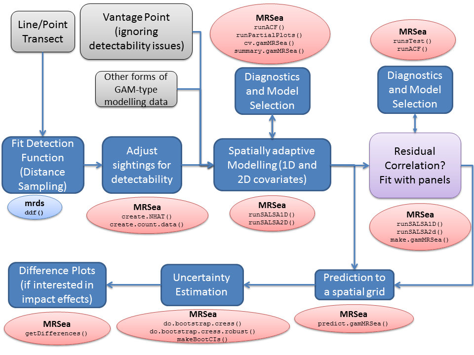

-------

#### This vignette constitutes work carried out at the Centre for Research into Ecological and Environmental Modelling (CREEM) at the University of St. Andrews.


**Please reference this document as:**
Scott-Hayward, L.A.S., Mackenzie, M.L. and Walker, C.G. (2021). Vignette for the MRSea Package v1.3: Statistical Modelling of bird and cetacean distributions in offshore renewables development areas. Centre for Research into Ecological and Environmental Modelling, University of St Andrews.

*******

```{r echo=FALSE, message=FALSE, warning=FALSE}
# require(knitcitations)
# cleanbib()
# #biblio <- read.bibtex(file = "newref.bib")
# biblio <- NULL
# cite_options(citation_format = 'pandoc', cite.style = 'authoryear', max.names = 1, longnamesfirst=FALSE)
knitr::opts_chunk$set(fig=TRUE, warning=FALSE, message=FALSE, 
                      eval=TRUE, cache=FALSE,
                      comment = '#>', collapse=TRUE, dev='png')
```

## Introduction

The `MRSea` package was developed for analysing data that was collected for assessing potential impacts of renewable developments on marine wildlife, although the methods are applicable to other studies as well. This vignette gives an updated example of the code for version 1.3.  For additional information regarding methods, see @Mac2013 and @ScottH2013a.  The user should be familiar with generalised linear models and their assumptions and model selection. The `MRSea` package primarily allows spatially adaptive model selection for both one and two dimensional covariates using the functions `runSALSA1D` and `runSALSA2D`, which implement the methods of @Walker2010, @ScottH2013 and @ScottH2022. 

The major update to this package (from version 0 to version 1)is that a class of model `gamMRSea` is created when running either SALSA 1D or 2D. This retains within the model object information regarding fitting, such as the `splineParam` object and the panel structure (if present).  The use of the `summary` function on these models returns both raw and robust standard errors, with the *p*-values from the models hypothesis test using the robust standard errors.  The robust standard errors are obtained using the panel structure given (independence is one panel per data point and is the default if no structure is given).

Other functions include diagnostics (to assess residual correlation: `runACF`, smooth relationships: `runPartialPlots` and model selection (ANOVA) for robust standard errors: `anova.gamMRSea`) and inference (`do.bootstrap.cress`). 



Example of the modelling process using MRSea.  Packages with functions to run certain parts are given in oval boxes.  To complete the modelling process, other packages may be used at certain stages.  These are coded light blue, whilst MRSea functions are in red.  


## Distance sampling using the `mrds` library

```{r eval=TRUE, echo=FALSE}
# load workpace
#load(file='mrseavignetteworkspace.RData')
require(mrds)
require(MRSea)
require(ggplot2)
require(RColorBrewer)
require(splines)
require(fields)
```

1. Load data and fit detection function (Distance Sampling)
```{r message=FALSE}
#devtools::load_all(path='../../MRSea/')
require(MRSea)
# we will use the dataset with a known re-distribution of animals
data(dis.data.re)
dis.data<-dis.data.re
require(mrds) # distance sampling package
result <- ddf(dsmodel=~mcds(key="hn", formula=~1),
              data = dis.data, method="ds", 
              meta.data=list(width=250))
```

```{r eval=TRUE}
result
```

```{r eval=TRUE}
plot(result)
```


2. Adjust sightings for detectability 

```{r dist, results='hide', warning=FALSE, message=FALSE}
# create.NHAT and create.count.data are MRSea functions to adjust the 
# sightings for the detection function estimated above.
dis.data <- create.NHAT(dis.data,result)
count.data <- create.count.data(dis.data)
```

3. Try a simple model

```{r message=FALSE, warning=FALSE}
count.data$response <- round(count.data$NHAT)
fullModel <- glm(response ~ as.factor(season) + as.factor(impact) +
                   depth + x.pos + y.pos, family = poisson, data = count.data)
```

4.  Try a model with a smooth term for depth

```{r message=FALSE}
require(splines)
fullModel <- glm(response ~ as.factor(season) + as.factor(impact) +
                   bs(depth, knots = mean(depth)) + x.pos + y.pos, 
                 family = poisson,data = count.data)
```

5.  If the data are correlated then you may wish to specify a blocking structure in your dataset. 

For correlated data:
```{r }
count.data$blockid <- paste(count.data$transect.id, 
                            count.data$season, 
                            count.data$impact,sep = "")
```


## Selection of 1D Covariates

Run SALSA1D to select what covariates are included and whether or not they are smooth.  SALSA selects the smoothness of each term (number and location of knots) and 10-fold CV is used to choose between the best smooth term, a linear term or no term at all.  To not allow the removal process the user may set `removal = FALSE` as a parameter in the function `runSALSA1D`.

6.  If you wish to make predictions once the model is fitted, then a prediction grid should be created and specified.  This is because the splines fitted here (B-splines) are unable to make predictions outside of the range they were created.  For example, if the data range for depth is smaller than the range of depths in the prediction data, predictions cannot be made.  

```{r }
data("nysted.predictdata")  # contains predict.data
# This is a spatial grid for making predictions.  All covariates in 
# final model must be in this data frame and the naming must be the 
# same as for the data
predictData <- nysted.predictdata
range(count.data$depth)
range(predictData$depth)
```

Here the range of the predictions is slightly wider than the range of the data, so we will specify ```predictData``` when running SALSA.

7. Set up the initial model with factor covariates and the offset term (if required) and specify the parameters required:

```{r message=FALSE}
initialModel <- glm(response ~ as.factor(season) + as.factor(impact) 
                    + offset(log(area)), family = "quasipoisson", 
                    data = count.data)
```

The fitness measure can be one of several options (AIC, BIC, QAIC, QBIC, CV). Here we use QBIC. 

```{r }
salsa1dlist <- list(fitnessMeasure = "QBIC", 
                    minKnots_1d = 2,
                    maxKnots_1d = 5, 
                    startKnots_1d = 1, 
                    degree = 2,
                    gaps = c(0))
```

If you want to use CV, you will need an additional parameter in the list; `cv.opts`

```{r }
salsa1dlist <- list(fitnessMeasure = "cv.gamMRSea", 
                    minKnots_1d = 2,
                    maxKnots_1d = 3, 
                    startKnots_1d = 1, 
                    degree = 2,
                    gaps = c(0), 
                    cv.opts=list(cv.gamMRSea.seed=1, K=10))
```

8. Run SALSA;

```{r message=FALSE, warning=FALSE, echo=TRUE, results='hide'}
# run SALSA
require(MuMIn)
salsa1dOutput <- runSALSA1D(initialModel, salsa1dlist, c("depth"),
                      predictionData=predictData, datain=count.data, removal=TRUE)
```

Use the built in summary function (`summary.gamMRSea`) to look at the summary of the model.  Note that robust standard errors are given alongside the raw standard errors and information regarding panels is at the bottom of the output. If each data point is a panel, then independence is assumed.

```{r eval=TRUE}
summary(salsa1dOutput$bestModel)
```


```{r eval=TRUE}
# How many knots were chosen for depth?
salsa1dOutput$splineParams[[2]]$knots
# ~~~~~~~~~~~~~~~~~~~~~~~
```


## Selection of flexibility for 2D smooth term

9. Create a grid of knots that will be used as possible knot locations.  This may take while and could be different every time you run it so I suggest saving the knotgrid as a file.

```{r knotgrid, fig=TRUE, fig.align='center', fig.width=9, fig.height=6}
knotgrid<- getKnotgrid(coordData = cbind(count.data$x.pos, count.data$y.pos), 
                       numKnots = 300,
                       plot = FALSE)
#
# write.csv(knotgrid, file='knotgrid_fullanalysis.csv', row.names=F)
# ~~~~~~~~~~~~~~~~~~~~~~~
```

10. Set up parameters for SALSA2D.  Distance matrices (data to knots and knot to knots), a fit statistic and min, max and start knots.

```{r }
# make distance matrices for datatoknots and knottoknots
distMats <- makeDists(cbind(count.data$x.pos, count.data$y.pos), knotgrid)

# ~~~~~~~~~~~~~~~~~~~~~~~

# make parameter set for running salsa2d
salsa2dlist<-list(fitnessMeasure = 'QBIC', 
                  knotgrid = knotgrid,
                  startKnots=10, 
                  minKnots=4, 
                  maxKnots=15, 
                  gap=0, 
                  interactionTerm="as.factor(impact)")
```

11. Run SALSA2D to find the appropriate number and location of knots for the 2D smooth term of `x.pos` and `y.pos`. The model inputted to the SALSA algorithm is the model output from the 1D SALSA run.  If you have no univariate smooth terms, you can put in the initial model in this step. 

```{r echo=TRUE, message=FALSE, warning=FALSE, results='hide'}
salsa2dOutput<-runSALSA2D(model = salsa1dOutput$bestModel, 
                          salsa2dlist = salsa2dlist, 
                          d2k=distMats$dataDist,
                          k2k=distMats$knotDist)
```


```{r eval=TRUE}
require(ggplot2)
ggplot() + geom_point(data=count.data, aes(x=x.pos, y=y.pos), colour='grey') +
  theme_bw() + 
  geom_point(data=data.frame(knotgrid), aes(X1, X2), col='blue') + 
  geom_point(data=data.frame(knotgrid)[salsa2dOutput$aR[[1]],], 
             aes(X1, X2), col='darkgreen', size=4) +
  coord_equal()

```

12.  Are the residuals correlated? Make a suitable blocking structure, within which residuals are expected to be correlated but between which they are independent.  Use `runACF` to assess the blocking structure.

```{r eval=TRUE, acfplot, fig.cap='ACF plot showing correlation in each block (grey lines), and the mean correlation by lag across blocks (red line).'}
runACF(block = count.data$blockid, model = salsa2dOutput$bestModel,
       suppress.printout=TRUE)
```

Here we also do a runs test to assess for correlation in the model residuals.  Since our data are over-dispersed, we must use the empirical distribution for assessment:

```{r}
simData<-generateNoise(n=500, response=fitted(salsa2dOutput$bestModel), family='poisson', d=summary(salsa2dOutput$bestModel)$dispersion)
empdist<-getEmpDistribution(500, simData, salsa2dOutput$bestModel, data=count.data,dots=FALSE)
```

```{r eval=TRUE}
runsTest(residuals(salsa2dOutput$bestModel, type='pearson'),emp.distribution=empdist)
```


13. Model selection

```{r eval=TRUE}
set.seed(1)
# 2D model
cv.gamMRSea(data=count.data, modelobject = salsa2dOutput$bestModel, K=10)$delta[2]
# salsa2dOutput$fitStat # alternatively

# 1D model
cv.gamMRSea(data=count.data, modelobject = salsa1dOutput$bestModel, K=10)$delta[2]

# intitial model
cv.gamMRSea(data=count.data, modelobject = initialModel, K=10)$delta[2]

```

```{r eval=TRUE}
anova(salsa2dOutput$bestModel)
```

```{r eval=TRUE, fig=TRUE, fig.align='center', fig.width=6, fig.height=4, message=FALSE}
par(mfrow=c(2,2))
runPartialPlots(model = salsa2dOutput$bestModel, data = count.data, 
                factorlist.in = c('season', 'impact'), 
                varlist.in = 'depth', showKnots = T, 
                includeB0 = TRUE)
```

```{r eval=TRUE, fig=TRUE, fig.align='center', fig.width=6, fig.height=4, message=FALSE}
par(mfrow=c(2,2))
runPartialPlots(model = salsa2dOutput$bestModel, data = count.data, 
                factorlist = c('season', 'impact'), varlist = 'depth', 
                showKnots = T, type='link', 
                includeB0 = TRUE)
```

## Making Predictions

```{r }
preddist<-makeDists(cbind(predictData$x.pos, predictData$y.pos), 
                 knotgrid, knotmat=FALSE)$dataDist


# make predictions on response scale
preds<-predict(newdata = predictData, 
               g2k = preddist, 
               object = salsa2dOutput$bestModel)
```

Plotting the predictions pre and post impact:

```{r }
require(RColorBrewer)
imp.labs <- c("Pre-Construction", "Post-Construction")
names(imp.labs) <- c("0", "1")
predictData$preds<-preds[,1]
```

```{r eval=TRUE, fig=TRUE, fig.align='center', fig.height=10, fig.width=8}
ggplot() + 
  geom_tile(data=predictData, aes(x.pos, y.pos, fill=preds), height=0.5, width=0.5) +
  facet_grid(season~impact , labeller = labeller(impact=imp.labs)) +
  theme_bw() + coord_equal() + 
  scale_fill_distiller(palette = "Spectral",name="Animal Counts")
```

## Bootstrapped Confidence Intervals and Difference Surfaces

Note that the coding in this section has changed slightly from the original user guide.

14. Bootstrap to include parameter estimation uncertainty in the detection function and parameter estimation in the spatial model. (Note: If no detection function estimated, then the bootstrap is just on the parameters of the spatial model.)

```{r boots, warning=FALSE, message=FALSE, results='hide'}
dis.data$seasonimpact <- paste(dis.data$season, dis.data$impact)

bootPreds<-do.bootstrap.cress.robust(model.obj = salsa2dOutput$bestModel, 
                                     predictionGrid = predictData,
                                     g2k=preddist,
                                     B = 100, 
                                     robust=TRUE)
```

```{r }
#load('predictionboot.RData')
cis <- makeBootCIs(bootPreds)
```

15. Calculate the differences before and after across all bootstraps
```{r }
differences <- getDifferences(beforePreds = 
                      bootPreds[predictData$impact == 0, ],
                      afterPreds = bootPreds[predictData$impact == 1, ])
```

16. Plot differences and indicate where significant positive/negative differences lie.  The grey circles indicate a significant negative difference (abundance after impact is less than the abundance before impact) and the grey crosses indicate a significant positive difference.  The colour of the cell indicates the size of the difference. 

```{r eval=TRUE, fig=TRUE, fig.align='center', fig.width=9, fig.height=6}
mediandiff <- differences$mediandiff
# The marker for each after - before difference:
# positive ('1') and negative ('-') significant differences
marker <- differences$significanceMarker
par(mfrow = c(1, 1))
quilt.plot(predictData$x.pos[predictData$impact == 0], 
           predictData$y.pos[predictData$impact == 0],
           mediandiff, asp = 1, nrow = 104, ncol = 55)
# add + or - depending on significance of cells. Just
# requires one significance out of all to be allocated
points(predictData$x.pos[predictData$impact == 0][marker == 1],
       predictData$y.pos[predictData$impact == 0][marker == 1],
       pch = "+", col = "darkgrey", cex = 0.75)
points(predictData$x.pos[predictData$impact == 0][marker == (-1)],
       predictData$y.pos[predictData$impact == 0][marker == (-1)],
       col = "darkgrey", cex = 0.75)
points(681417.3/1000, 6046910/1000, cex = 3, pch = "*", lwd = 1, col = "grey")
```

Select a single season to plot (here I have chosen season 1):

```{r eval=TRUE, fig.width=9, fig.height=6}
require(dplyr)
diffdata<-data.frame(predictData[predictData$impact==0,], mediandiff, marker)
diffdata_s1<-filter(diffdata, season==1)

wf<-data.frame(x=(681417.3/1000), y= (6046910/1000))

ggplot() + geom_tile(data=diffdata_s1, aes(x=x.pos, y=y.pos, fill=mediandiff), 
                     height=0.5, width=0.5) + 
  geom_point(data=filter(diffdata_s1, marker == 1), aes(x=x.pos, y=y.pos), 
             shape=3, colour='darkgrey', size=1) +
  geom_point(data=filter(diffdata_s1, marker == -1), aes(x=x.pos, y=y.pos), 
             shape=1, colour='darkgrey', size=1.5) +
  theme_bw() + coord_equal() +  
  scale_fill_distiller(palette = "Spectral",name="Difference") + 
  geom_point(data=wf, aes(x, y), shape=8, size=4)
  
```

Or, all seasons (remember season is only in as a factor variable so there will be no change in spatial distribution between seasons, only an increase or decrease in numbers):

```{r, eval=TRUE, fig.width=9, fig.height=7}
ggplot() + geom_tile(data=diffdata, aes(x=x.pos, y=y.pos, fill=mediandiff), 
                     height=0.5, width=0.5) + 
  geom_point(data=filter(diffdata, marker == 1), aes(x=x.pos, y=y.pos), 
             shape=3, colour='darkgrey', size=1) +
  geom_point(data=filter(diffdata, marker == -1), aes(x=x.pos, y=y.pos), 
             shape=1, colour='darkgrey', size=1.5) +
  theme_bw() + coord_equal() + facet_wrap(~season) + 
  scale_fill_distiller(palette = "Spectral",name="Difference") + 
  geom_point(data=wf, aes(x, y), shape=8, size=4)
```

## Diagnostic functions in the MRSea package

I will use the best model above to run some additional diagnostics.

```{r}
finalmod<-salsa2dOutput$bestModel
```

### Autocorrelation check

These are already shown above so are not re-run here but included for completeness. 

Autocorrelation function plot:

```{r eval=FALSE}
runACF(block = count.data$blockid, model = salsa2dOutput$bestModel,
       suppress.printout=TRUE)
```

Empirical runs test calculation:

```{r, eval=FALSE}
simData<-generateNoise(n=500, 
                       response=fitted(salsa2dOutput$bestModel), 
                       family='poisson', 
                       d=summary(salsa2dOutput$bestModel)$dispersion)
empdist<-getEmpDistribution(500, simData, salsa2dOutput$bestModel, data=count.data,dots=FALSE)
```

```{r eval=FALSE}
runsTest(residuals(salsa2dOutput$bestModel, type='pearson'), emp.distribution=empdist)
```

### `runDiagnostics`

This function creates observed vs fitted and fitted vs scaled pearsons residual plots.

```{r, eval=TRUE, fig.width=9, fig.height=6}
runDiagnostics(finalmod)
```

### Influence diagnostics

These functions assess the influence of different blocks on the data. 

```{r eval=TRUE}
timeInfluenceCheck(finalmod, id = count.data$blockid)
```

```{r, eval=TRUE, fig.width=9, fig.height=6}
inflpoints<-runInfluence(finalmod, id = count.data$blockid)
```

### Cumulative residual plots

Cumulative residual plots are returned for residuals ordered by each covariate in `varlist`, predicted value and index of observations (temporally). The blue dots are the residuals and the black line is the line of cumulative residual. On the covariate plots (those in `varlist`) the grey line indicates what we would expect from a well fitted covariate. i.e. one that is fitted with excessive knots.

```{r,eval=TRUE, fig.width=9, fig.height=7}
plotCumRes(model = finalmod, varlist = 'depth')
```

### Mean-variance check

Not a function in MRSea but an essential component to model assessment is the mean variance relationship. In the plot below, the dots are the observed mean and variance for several bins of the fitted data.  The red line is the assumed mean-variance relationship.

```{r}
cutpts<-unique(quantile(fitted(finalmod), prob=seq(0,1, by=0.05)))
mycuts<-cut(fitted(finalmod), breaks= cutpts)
meanfits<-tapply(fitted(finalmod), mycuts, mean)
varresid<-tapply(residuals(finalmod, type='response'), mycuts, var)
  
plot(meanfits, varresid, xlab='Fitted Values', ylab='V(residuals)')
abline(0,1)
lines(meanfits, meanfits*summary(finalmod)$dispersion, col='red')
```


## Other useful functions in the MRSea package

### Making any `glm` model into an `gamMRSea` object

This can be done using the `make.gamMRSea` function.  Here we use the `fullmodel` which is a `glm` model with `family='poisson'`

```{r eval=TRUE}
fullModel$call
```


```{r}
fullModel.gamMRSea <- make.gamMRSea(fullModel,  
                                    gamMRSea = TRUE)
                                    
```

```{r eval=TRUE}
summary(fullModel.gamMRSea)
```


### Adding a panel structure to a model

Additionally, if you choose to fit the SALSA or GLM models without a panel structure, the `make.gamMRSea` function can be used to add a panel structure afterwards.

```{r, eval=TRUE}
finalmod.robustse <- make.gamMRSea(finalmod,  
                                    gamMRSea = TRUE,
                                    panelid = count.data$blockid)
```


```{r}
summary(finalmod.robustse)
```


<!-- ```{r, eval=FALSE, echo=FALSE, include=FALSE} -->
<!-- save.image(file='mrseavignetteworkspace.RData', compress="bzip2") -->
<!-- ``` -->
